#
 Architecture Diagram

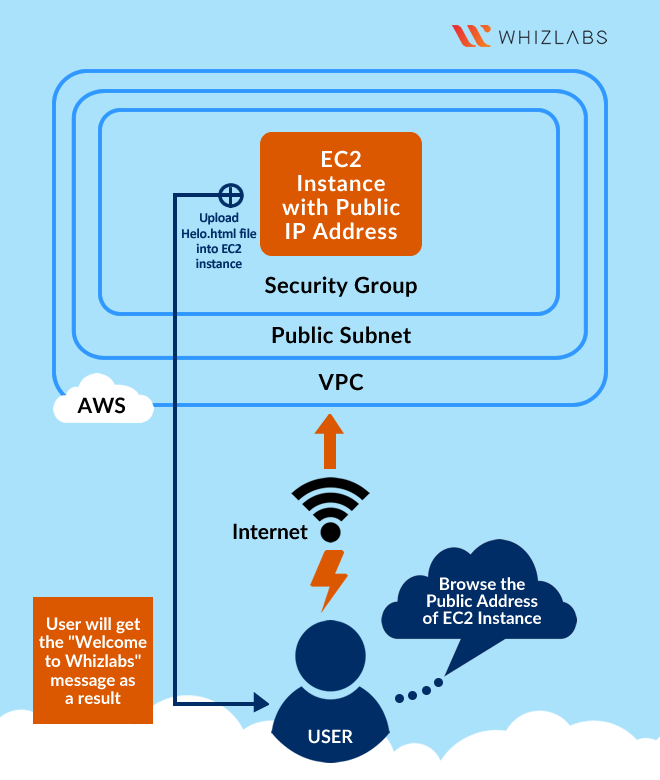

Task Details
1. Sign in to AWS Management Console

2. Launch an EC2 instance with desired specifications

3. SSH into the EC2 instance using the key pair

4. Install an Apache server on the instance

5. Create a web page and publish it on the instance

6. Validation of the Lab

Task 1 : Launch an EC2 Instance with desired specifications
1. Ensure you are in the US East (N. Virginia) us-east-1 Region to begin launching an EC2 instance in the Amazon cloud.

2. Navigate to EC2 by clicking on the Services menu in the top, then click on EC2 in the Compute section.

3. Click on the Instances option on the left panel, and then click on the Launch Instances button.

4. Name : Enter MyEC2Server

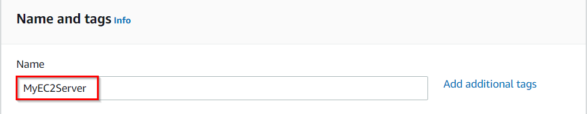

5. Search for Amazon Linux 2 AMI in the search box and select it by clicking on the Select button.

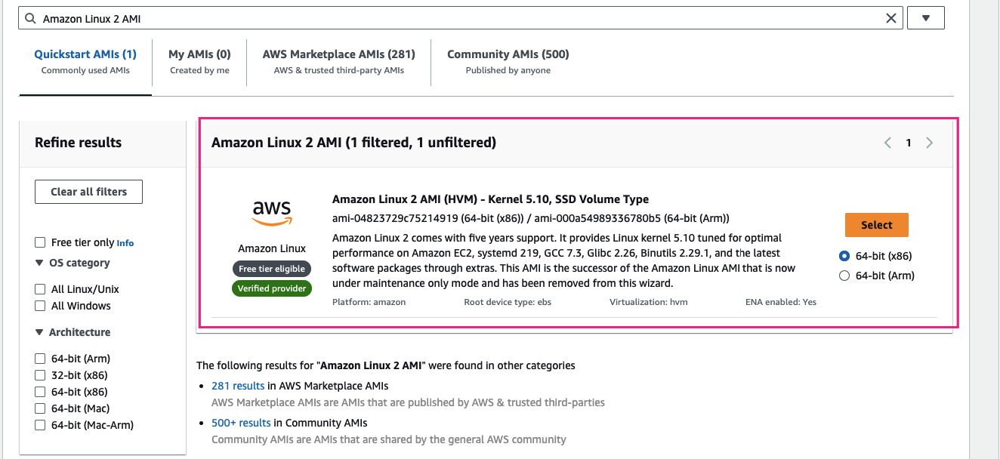

Note: if there are two AMI's present for Amazon Linux 2 AMI, choose any of them.

6. An instance type in AWS refers to a virtual server configuration that determines the computing resources, such as CPU, memory, and storage, available to an instance. It is the basic building block for creating an EC2 instance in the AWS cloud.

7. For Instance Type: Select t2.micro
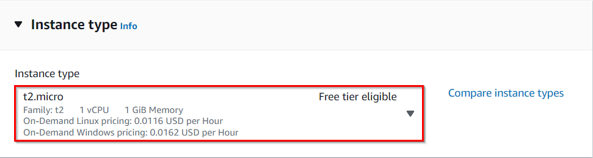

8. t2.micro is an instance type in AWS that comes with 1 vCPU, and 1GB memory and is suitable for low-traffic web servers, small development environments, and other lightweight applications.
AWS key pair is a secure pair of keys used for login and access to EC2 instances. It includes a public key placed on the instance and a private key kept on the user's local computer, used for authentication to prevent unauthorized access.

* For Key pair(login): Select Create a new key pair Button

* Key pair name: WhizKey

* Key pair type: RSA

* Private key file format: .pem

9. In Network Settings Click on Edit Button:

* Auto-assign public IP: Enable

* Select Create security group

* Security group name: Enter MyEC2Server_SG

* Description: Enter Security Group to allow traffic to EC2  

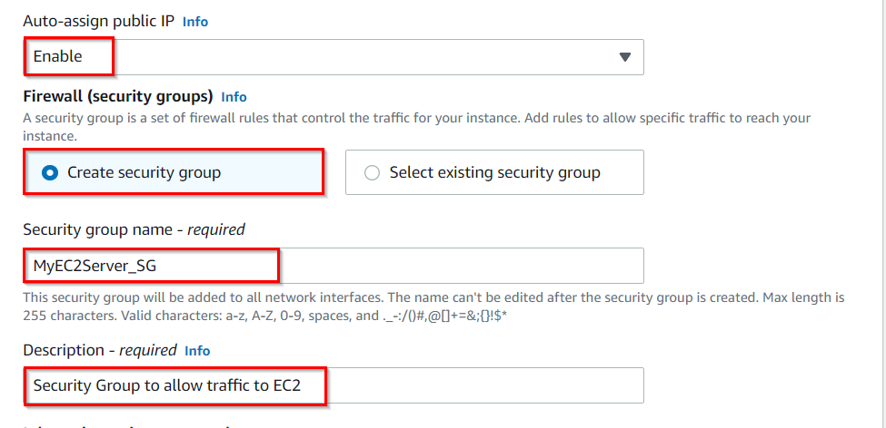

    

* We will now add the security group rules. SSH will already be present there. 
* For HTTP, Select Add security group rule Button
* Choose Type: Select HTTP 
* Source: Select Anywhere\

 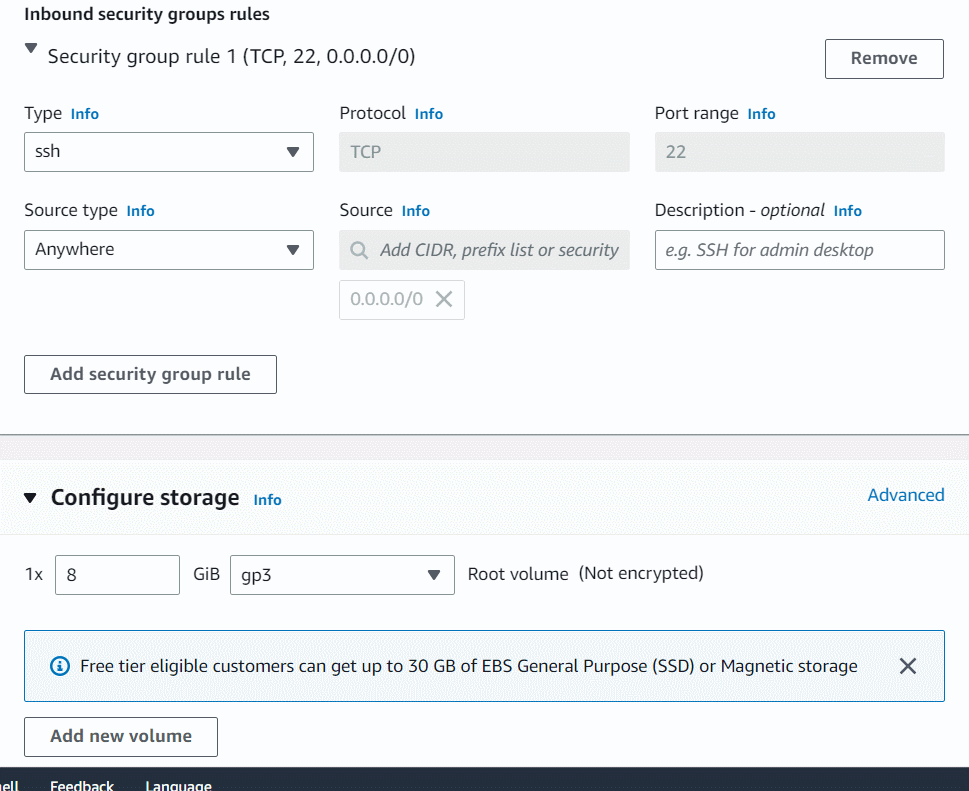

10. A security group is a virtual firewall that controls the inbound and outbound traffic for instances in a particular network in a cloud computing environment. Here we have selected SSH and HTTP rules that will allow incoming SSH and HTTP traffic to instances that are associated with the security group.

11. Proceed with launching the instance while leaving all other settings as default. Simply click on the Launch Instance without modifying any other configuration.

12. To view the instance that you have created, choose the View all Instances option.

13. Launch Status: Once you have initiated the instance launch process, Go to the Instances page from the left menu and wait for your EC2 instance to become "Running" while ensuring the health check status is 2/2 checks passed for optimal performance.

  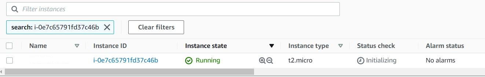

14. Select the instance that you have created and copy the public IPv4 address within the details section and paste it into the editor for later use. An example of this process is depicted in the screenshot provided.

  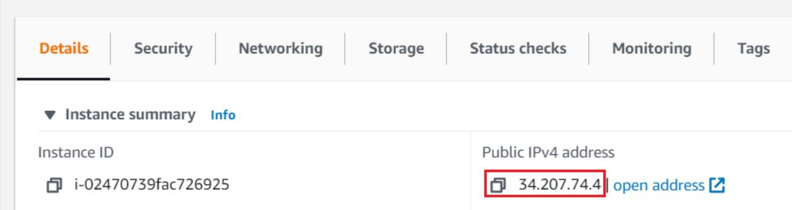

Task 2 : SSH into EC2 Instance using the key pair
1. Select your EC2 instance(MyEC2Server) and click on the Connect button.
 
  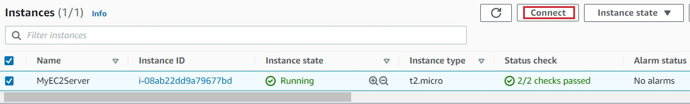

2. Select EC2 Instance Connect option and click on Connect button.(Keep everything else as default)

3. A new tab will open in the browser where you can execute the Linux Commands.

4. Please follow the steps in SSH into EC2 Instance for more options to SSH. 
 
 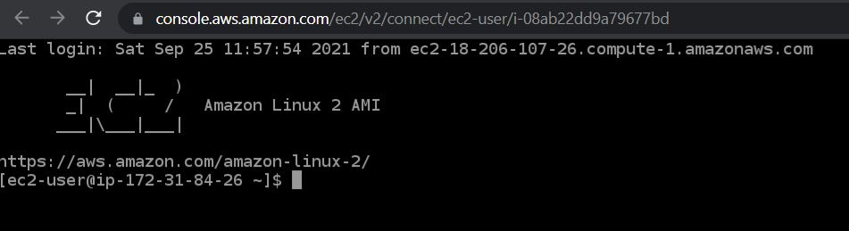

Task 3: Install an Apache Server on the instance
In this task, our goal is to configure an Amazon EC2 instance to run an Apache Web Server and verify its functionality by accessing the web server via a web browser using the instance's public IPv4 address.

1. Switch to root user:
sudo su

2. Now run the updates using the following command:
yum -y update

3. Once completed, lets install and run an apache server

4. Install the Apache web server:
yum install httpd -y

5. Start the web server:
systemctl start httpd

6. Now Enable httpd:
systemctl enable httpd

7. Check the webserver status
systemctl status httpd

8. You can see Active status is running.

9. You can test that your web server is properly installed and started by entering the public IPv4 address of your EC2 instance in the address bar of a web browser. If your web server is running, then you see the Apache test page. If you don't see the Apache test page, then verify whether you followed the above steps properly and check your inbound rules for the security group that you created.

Task 6 : Create a web page and publish it on the instance
In this task, you will add content to the index.html file using the "echo" command and restart the webserver. Then, you can view the content by entering the public IPv4 address followed by "/index.html" in a web browser, ensuring that the URL protocol is HTTP. 

To add the contents into index.html file using echo, copy and paste the below command to shell.

echo "<html>Hi Whizlabs, I am a public page</html>" > /var/www/html/index.html
2. Restart the webserver by using the following command:

systemctl restart httpd
3. Now enter the file name, /index.html after the public IPv4 Address which you got when you created the ec2 instance in the browser, and you can see your HTML content.

Make sure URL Protocol is http not https.
Syntax: http://<Your_Public_IPv4_Address>/index.html
Sample URL: http://52.87.50.168/index.html
Note: If the index.html page is not loading, try removing s from the link, it should be HTTP.
               
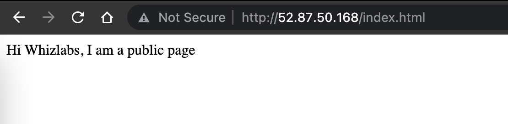

       4. If you can see the above text in the browser, then you have successfully completed the lab.

Completion and Conclusion

1. You have successfully created and launched an Amazon EC2 instance

2. You have successfully logged into the EC2 instance using SSH

3. You have successfully installed an Apache server on the instance

4. You have successfully created a webpage and published it.       

